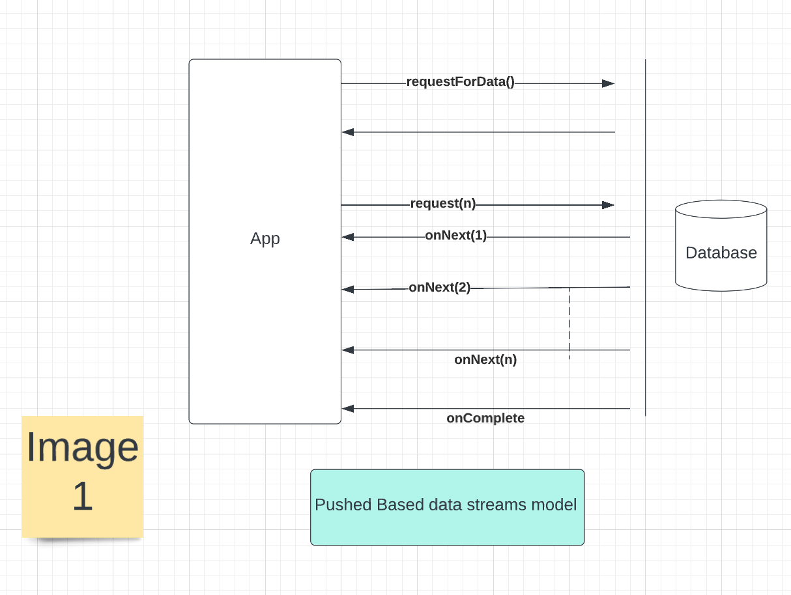
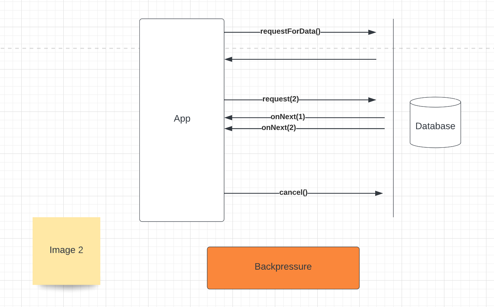
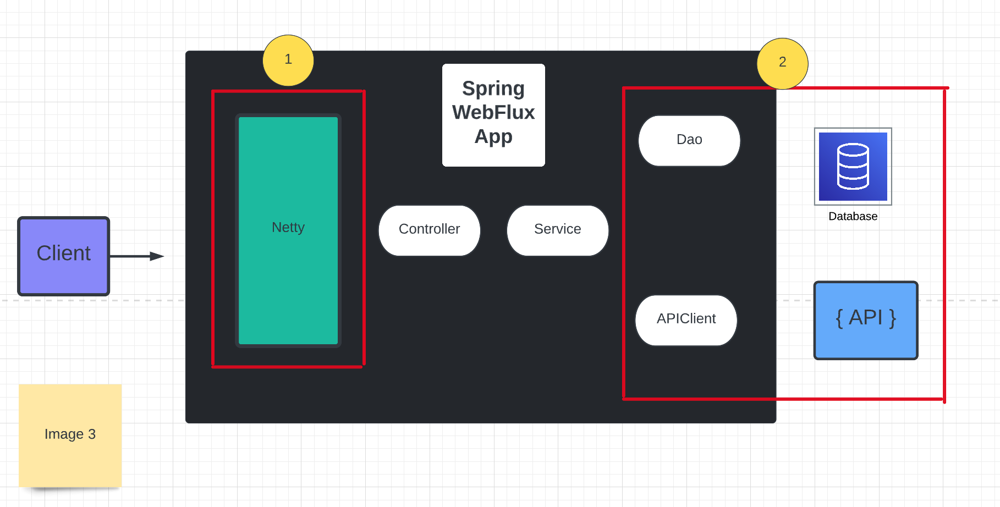
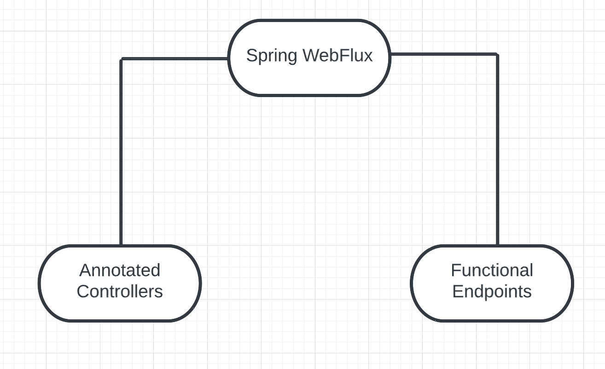
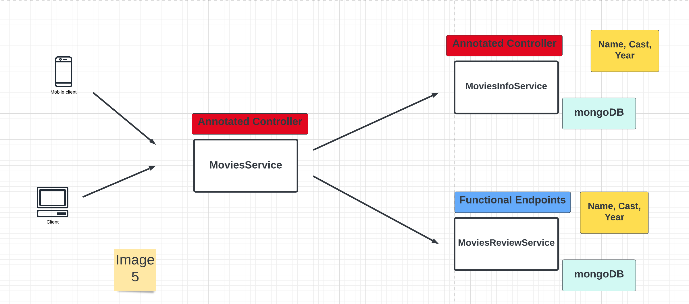
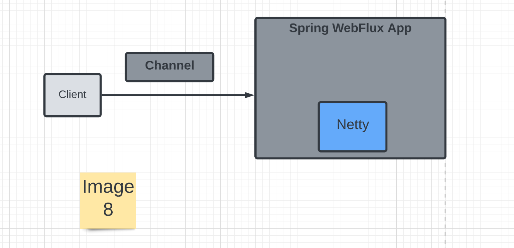
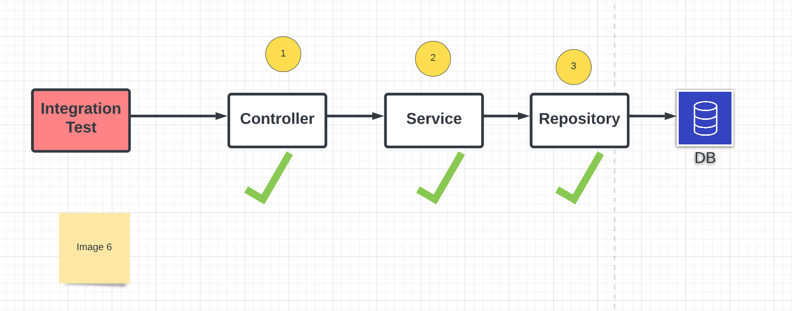
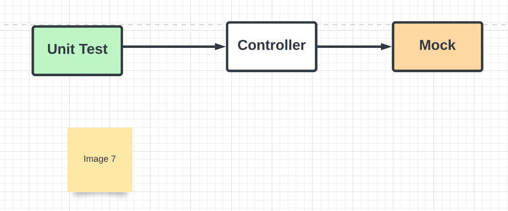

# spring-webflux-microservice - Movies Application using MicroServices Pattern

## Reactive Programming

1. Reactive programming is a new programming paradigm.
2. Asynchronous and non blocking
3. Data flows as an Event/Message driven stream called reactive stream
4. Calling thread is released to do useful work
5. Actual data will be sent using the onNext() function to the app. 
6. The numbers in the onNext functions, actual data that is returned to the app.
7. Once all the results are sent to the app then there will be an completion event that signals the app there is no more data and event will be sent using the onComplete function. 

This is how the code and data flows work in reactive programming. Any code we write with reactive programming will be Functional Style Code.

## Backpressure

Key feature of reactive programming is the support of BackPressure on Data Streams

You request for data and you know the caller know immediately. There will be another request form the app which has information about how many of the data the app needs. From this diagram we are requesting for stream of two events.  As a result you will get two events from the data source. Once there events are processed by the app, then we have two options, whether we can ask for more data or cancel the request. Let’s say we don’t want any more data after receiving the first stream of two events, the cancel() request will be sent to the data source from the app and no data will be sent after that. This concept of app controlling the data is called Backpressure.

### Reactive programming is a combination of push and pull based data flow model. 

## When to use Reactive Programming?

We can use reactive programming when there is need to build and support high load with the available resources. Let’s say we have an app that needs to support 400 TPS, then reactive programming may be a good candidate.  

## What is Nonblocking or Reactive RestFul API?

A Non-Blocking or Reactive RestFul API has the behavior of providing end to end non-blocking communication between the client and service. 

Non-Blocking or Reactive == Not Blocking the thread that is involved handling the client HTTP request. That means thread involved in handling the httprequest and httpresponse is not blocked at all. 

Spring WebFlux is a reactive module that’s going to help us in achieving the Non-Blocking or Reactive behavior. 

### Spring WebFlux Module:

Any time we build spring web flux app using spring boot, it is going to come up with embedded server, and this default embedded server is Netty. This is really important to enable non blocking network interaction at the server level. Netty is a popular for handling non blocking I/O behind the scene and as a developer we can focus on writing endpoint and business logic for our api. 
If we look at the following diagram, we must have non blocking behavior at this two specific external interaction. 

1. Handling the HTTP request from the client which is the entry point for the app. Netty can take care of handling that for us. 

2. The other non blocking behavior that needs to be addressed is where our application interacts with the external systems. In our case it’s database and external service or api.
    a. Project reactor is a reactive library, which has implementation of reactive streams, which is used to enable non blocking interactions with these          external systems.

So again non blocking means, we are not going to block the thread at all, at the same time we are going to interact with these external systems and make the call and retrieve the data.

## Introduction to Project Reactor

1. Project Reactor is an implementation of Reactive Streams Specification
2. Project Reactor is a Reactive Library
3. Spring WebFlux uses Project Reactor by default

So if you are planning to use Spring WebFlux for building non-blocking api, then it comes with project reactor as a reactive library to write non blocking code. 

## Flux & Mono

1. Flux & Mono is a reactive type that implements the Reactive Streams specification. 
2. Flux & Mono is part of the reactor-core module. 
3. Flux is a reactive type to represent 0 to N elements. Let’s say you make a request to DB or external API or remote service which is going to give you more than one element as per of the request, then you would use Flux type to represent the data.
4. Mono is a reactive type to represent 0 to 1 element. Let’s say you make a request to DB or remote service, which is going to fetch you one element then in that case you would use Mono to represent the data. 

Fundamentally we have two flavours when it comes building restful api in spring webflux. 

## Movies Application Using Microservices Pattern

Initially we have built MoviesInfoService application, which is going to hold the information about the movies such as name, cast and year the movie got released and more. Then we have built MovieReviewService application which is going to hold rating and review information which is nothing but the feedback which is provided for the movie. And after that we have developed MoviesService application which is going to interact with these two services to provide the complete information about the movie.

In a microservices architecture it is pretty common to split the business functionality to it’s independent services and have an edge service that is going to interact with this two services (MoviesInfoService & MovieReviewService) to provide the complete information about the movie. The client will be interacting with the MovieService, to retrieve the complete information about the movie. MoviesInfoService & MovieReviewService will use the mongoDB as a persistence layer for storing the movies info and review. We have used annotated controller approach for MoviesService and MoviesInfoService for building the reactive restful api. And for MoviesReviewService, we have used functional endpoints approach inorder to build the reactive restful api. So as a whole we have developed three applications by exploring two different approaches that are available in spring webflux for building non-blocking apis. 

## How does Netty handle the request?

Any time client makes a request to the app, a channel is created. A channel represents an open connection between the client and server and the request and response is sent through the channel. 

A channel in general has ChannelHandlers. ChannelHandlers typically takes care of accepting the client connection and it also takes care of converting the bytes it receives over the network to a POJO. Once the data for the request is ready, then it takes care of writing the data back to client. This is all taken care for us under the hood by the spring webflux module. As a developer, we just focus on writing the application related code. 

## EventLoop

Netty, uses EventLoop model to handle the connections in a nonblocking fashion. An EventLoop is powered by one single thread. NodeJS uses the same pattern. NodeJS has just one thread/one event loop to handle client requests. Netty uses the same event loop designed similar to what NodeJS does. But the number of threads/Eventloops to handle the request is equal to no of cores in your machine. So you have multiple eventloops and they all are part of higher construct name EventLoopGroup. So basically eventloops are group together to form EventLoopGroup. 

Any time a channel is created it gets assigned to an EventLoop that is part of the netty. This EventLoop is responsible for handling the different events that occurs in the lifetime of a channel. 

## How Netty handles the request

Netty has two EventloopGroups. One to just accept the connection and create the channel. And the second event loop group handle the channel. All the created channel are handled over to the second event loop group that takes care of handling the channel which means reading the data from the request and writing the response back to the client and closing the channel and more.

## Automated Tests

Automated Tests plays a vital role in delivering quality software. We have focused two types of automated tests in this project. 

1. Integration Tests
2. Unit Tests

### Integration Tests

Integration test is a kind of test which actually test the application end to end. It is pretty common for restful api that is built using spring boot to have these different layer from this diagram. 
The controller layer is the entry point of the application where the client request gets mapped. And the service layer where the business logic resides. And the repository layer where the DB related code resides. 
So when we write an integration test for the controller layer, that test basically covers all the layer of the app. In this case the test will make sure the test case interacts from the controller layer to the repository layer that is all about the integration test.

### Unit Tests

Unit test is a kind of test which tests only the class and method of interest and mocks the next layer of the code.  Let me explain with an example:

Now if we are going to write unit test for the controller layer, instead of controller actually interact with service layer, it will introduce a mock instance to mock the behavior of the service layer. 
Here we have used mocking library called Mockito. 

